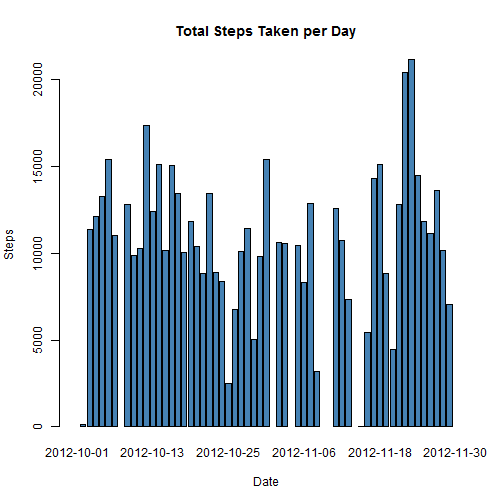
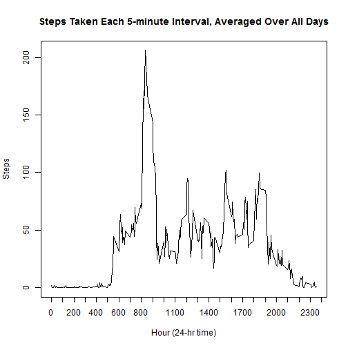
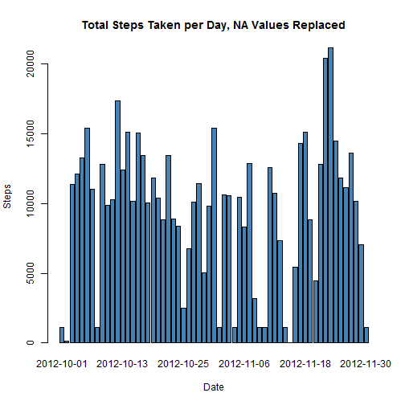
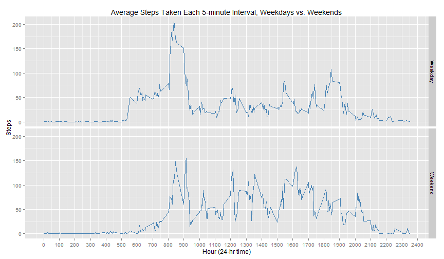

Reproducible Research Project 1
========================================================================================

This document will take you through a number of different analyses and plots to look at date gathered from a personal activity monitor device. The data is stored in a csv file, with three variables of information:

-**steps** the number of steps taken in a five-minute interval

-**date** the date in YYYY-MM-DD format, ranging from October 1 through November 30, 2012

-**interval** the identifier for the five-minute interval in which the measurement was taken. Think of the identifier as telling the time on a 24-hour clock without the colon between hours and minutes.


Let's get started.


The first thing we need to do is make sure the file is saved in your working directory. Since it was pulled from the forked Github repository, I will assume it is there. Next, it is a good idea to load all the packages we will need to use for our analyses from the library. I will only be using two packages here, **dplyr**, to easily manipulate data into the format needed to make our calculations and plots, and **ggplot2** for the final plot. 


```r
library(dplyr)
library(ggplot2)
```

Simple. Next we need to read the data from the csv file, and transfer it into dplyr.


```r
steps <- read.csv("activity.csv")
```

```
## Warning in file(file, "rt"): cannot open file 'activity.csv': No such file
## or directory
```

```
## Error in file(file, "rt"): cannot open the connection
```

```r
steps2 <- tbl_df(steps)
```

Let's take a quick look at our data. The nice thing about the dplyr package is that it gives us some basic information and shows the first 10 lines just by printing it


```r
steps2
```

```
## Source: local data frame [17,568 x 3]
## 
##    steps       date interval
##    (int)     (fctr)    (int)
## 1     NA 2012-10-01        0
## 2     NA 2012-10-01        5
## 3     NA 2012-10-01       10
## 4     NA 2012-10-01       15
## 5     NA 2012-10-01       20
## 6     NA 2012-10-01       25
## 7     NA 2012-10-01       30
## 8     NA 2012-10-01       35
## 9     NA 2012-10-01       40
## 10    NA 2012-10-01       45
## ..   ...        ...      ...
```

We have 17,568 observations across three variable. We have a lot of missing values in the steps variable. Perhaps more importantly, the date variable is of class factor. This will need to be changed to class date to be usable for making plots later on, so lets change this now.


```r
steps2 <- mutate(steps2, date=as.Date(date, format="%Y-%m-%d"))
steps2
```

```
## Source: local data frame [17,568 x 3]
## 
##    steps       date interval
##    (int)     (date)    (int)
## 1     NA 2012-10-01        0
## 2     NA 2012-10-01        5
## 3     NA 2012-10-01       10
## 4     NA 2012-10-01       15
## 5     NA 2012-10-01       20
## 6     NA 2012-10-01       25
## 7     NA 2012-10-01       30
## 8     NA 2012-10-01       35
## 9     NA 2012-10-01       40
## 10    NA 2012-10-01       45
## ..   ...        ...      ...
```

There, now we have transformed the date variable to be of the right class. We can move forward with the assignment


##Part 1

The first part of the assignment asks us to complete two tasks: make a histogram of the total steps taken each day, and calculate the mean and median of the total steps taken each day. In order to do this, we need to add up all the steps taken in each five-minute interval. This is best done by grouping the data in our data frame by day, and using the summarize() function.


```r
total_steps <-  steps2 %>% 
                group_by(date) %>% 
                summarize(sum(steps), 
                          mean(steps), 
                          median(steps))
total_steps
```

```
## Source: local data frame [61 x 4]
## 
##          date sum(steps) mean(steps) median(steps)
##        (date)      (int)       (dbl)         (dbl)
## 1  2012-10-01         NA          NA            NA
## 2  2012-10-02        126     0.43750             0
## 3  2012-10-03      11352    39.41667             0
## 4  2012-10-04      12116    42.06944             0
## 5  2012-10-05      13294    46.15972             0
## 6  2012-10-06      15420    53.54167             0
## 7  2012-10-07      11015    38.24653             0
## 8  2012-10-08         NA          NA            NA
## 9  2012-10-09      12811    44.48264             0
## 10 2012-10-10       9900    34.37500             0
## ..        ...        ...         ...           ...
```

This new data frame takes the name for the new columns from the function used in the call to summarize, which is not optimal. Let's change the names of those columns now.


```r
total_steps <- rename(total_steps, 
                      total.steps=`sum(steps)`,
                      mean.steps=`mean(steps)`,
                      median.steps=`median(steps)`)
total_steps
```

```
## Source: local data frame [61 x 4]
## 
##          date total.steps mean.steps median.steps
##        (date)       (int)      (dbl)        (dbl)
## 1  2012-10-01          NA         NA           NA
## 2  2012-10-02         126    0.43750            0
## 3  2012-10-03       11352   39.41667            0
## 4  2012-10-04       12116   42.06944            0
## 5  2012-10-05       13294   46.15972            0
## 6  2012-10-06       15420   53.54167            0
## 7  2012-10-07       11015   38.24653            0
## 8  2012-10-08          NA         NA           NA
## 9  2012-10-09       12811   44.48264            0
## 10 2012-10-10        9900   34.37500            0
## ..        ...         ...        ...          ...
```

That's better. Now we can plot our histogram.


```r
barplot(total_steps$total.steps, 
        names.arg = total_steps$date, 
        main = "Total Steps Taken per Day", 
        ylab = "Steps",
        xlab = "Date",
        col = "steelblue")
```

 

As we can see, because of the number of missing values throughout the data, our histogram comes with a lot of gaps. We will address these gaps a little later in the assignment.

Next, we want to calculate and report the mean and median total steps taken each day. I fit the calculation earlier in the total_steps data frame. Now we just need to report it cleanly. I'll do this using the View() function in dplyr.


```r
MM_Table <- select(total_steps, -(total.steps))
print.data.frame(MM_Table)
```

```
##          date mean.steps median.steps
## 1  2012-10-01         NA           NA
## 2  2012-10-02  0.4375000            0
## 3  2012-10-03 39.4166667            0
## 4  2012-10-04 42.0694444            0
## 5  2012-10-05 46.1597222            0
## 6  2012-10-06 53.5416667            0
## 7  2012-10-07 38.2465278            0
## 8  2012-10-08         NA           NA
## 9  2012-10-09 44.4826389            0
## 10 2012-10-10 34.3750000            0
## 11 2012-10-11 35.7777778            0
## 12 2012-10-12 60.3541667            0
## 13 2012-10-13 43.1458333            0
## 14 2012-10-14 52.4236111            0
## 15 2012-10-15 35.2048611            0
## 16 2012-10-16 52.3750000            0
## 17 2012-10-17 46.7083333            0
## 18 2012-10-18 34.9166667            0
## 19 2012-10-19 41.0729167            0
## 20 2012-10-20 36.0937500            0
## 21 2012-10-21 30.6284722            0
## 22 2012-10-22 46.7361111            0
## 23 2012-10-23 30.9652778            0
## 24 2012-10-24 29.0104167            0
## 25 2012-10-25  8.6527778            0
## 26 2012-10-26 23.5347222            0
## 27 2012-10-27 35.1354167            0
## 28 2012-10-28 39.7847222            0
## 29 2012-10-29 17.4236111            0
## 30 2012-10-30 34.0937500            0
## 31 2012-10-31 53.5208333            0
## 32 2012-11-01         NA           NA
## 33 2012-11-02 36.8055556            0
## 34 2012-11-03 36.7048611            0
## 35 2012-11-04         NA           NA
## 36 2012-11-05 36.2465278            0
## 37 2012-11-06 28.9375000            0
## 38 2012-11-07 44.7326389            0
## 39 2012-11-08 11.1770833            0
## 40 2012-11-09         NA           NA
## 41 2012-11-10         NA           NA
## 42 2012-11-11 43.7777778            0
## 43 2012-11-12 37.3784722            0
## 44 2012-11-13 25.4722222            0
## 45 2012-11-14         NA           NA
## 46 2012-11-15  0.1423611            0
## 47 2012-11-16 18.8923611            0
## 48 2012-11-17 49.7881944            0
## 49 2012-11-18 52.4652778            0
## 50 2012-11-19 30.6979167            0
## 51 2012-11-20 15.5277778            0
## 52 2012-11-21 44.3993056            0
## 53 2012-11-22 70.9270833            0
## 54 2012-11-23 73.5902778            0
## 55 2012-11-24 50.2708333            0
## 56 2012-11-25 41.0902778            0
## 57 2012-11-26 38.7569444            0
## 58 2012-11-27 47.3819444            0
## 59 2012-11-28 35.3576389            0
## 60 2012-11-29 24.4687500            0
## 61 2012-11-30         NA           NA
```


##Part 2

The next part of the assignment asks us to calculate the average daily activity pattern. We'll average the number of steps taken in each five-minute interval across all days. So this time we'll group by interval and use summarize() to find the average steps for each interval. In order to not have out calculations interrupted by missing values, we'll have to remove all NAs. Again, we will rename the new column for average steps.


```r
mean_interval <- steps2 %>% 
                 group_by(interval) %>% 
                 summarise(mean(steps, na.rm=TRUE))

mean_interval <- rename(mean_interval,
                        average.steps=`mean(steps, na.rm = TRUE)`)

mean_interval
```

```
## Source: local data frame [288 x 2]
## 
##    interval average.steps
##       (int)         (dbl)
## 1         0     1.7169811
## 2         5     0.3396226
## 3        10     0.1320755
## 4        15     0.1509434
## 5        20     0.0754717
## 6        25     2.0943396
## 7        30     0.5283019
## 8        35     0.8679245
## 9        40     0.0000000
## 10       45     1.4716981
## ..      ...           ...
```

Now we can go ahead and make a time-series plot.


```r
with(mean_interval, plot(interval, average.steps, 
                         type = "l",
                         xlab = "Hour (24-hr time)",
                         ylab = "Steps",
                         main = "Steps Taken Each 5-minute Interval, Averaged Over All Days",
                         xaxp=c(0, 2400, 24)))
```

 

As this plot shows us, the five-minute interval with the highest number of average steps corresponds to 8:35 in the morning.


##Part 3

The next part of the assignment asks us to replace the missing values and then rerun the plot from Part 1 with the missing values filled in to see how the two plots compare. I decided to replace the missing values with the average steps taken in each interval rather than the average steps taken each day, because this will more accurately reflect the amount of activity likely to be happening at any given time of day (i.e., it is more accurate to replace a missing value occurring between midnight and 12:05 with the average number of steps taken in that interval for all days, which is likely to be very small, rather than filling in the average number of steps taken over that particular day, which would be much higher).

First we need to know how many missing values there are total. We can do this with the count() function.


```r
count_NA <- count(steps2, steps)
```

because dplyr always puts missing values at the bottom of the list, no matter how you order the values, we can print out the number of missing values by subsetting using the length of our new vector.


```r
count_NA[length(count_NA$steps), ]
```

```
## Source: local data frame [1 x 2]
## 
##   steps     n
##   (int) (int)
## 1    NA  2304
```

We have 2,304 missing values in our data frame.

Now we will replace those missing values with the mutate() function, checking each value to see if it is NA and replacing it with the average number of steps taken during that interval if it is.


```r
rm_NA <- steps2 %>% 
         group_by(interval) %>% 
         mutate(steps = ifelse(is.na(steps), median(steps, na.rm=TRUE), steps))
rm_NA
```

```
## Source: local data frame [17,568 x 3]
## Groups: interval [288]
## 
##    steps       date interval
##    (int)     (date)    (int)
## 1      0 2012-10-01        0
## 2      0 2012-10-01        5
## 3      0 2012-10-01       10
## 4      0 2012-10-01       15
## 5      0 2012-10-01       20
## 6      0 2012-10-01       25
## 7      0 2012-10-01       30
## 8      0 2012-10-01       35
## 9      0 2012-10-01       40
## 10     0 2012-10-01       45
## ..   ...        ...      ...
```

With the missing values filled in, we can create a new data set using the same process in Part 1.


```r
total_steps2 <- rm_NA %>% 
                group_by(date) %>% 
                summarize(sum(steps), 
                          mean(steps), 
                          median(steps))

total_steps2 <- rename(total_steps2, 
                      total.steps=`sum(steps)`,
                      mean.steps=`mean(steps)`,
                      median.steps=`median(steps)`)
total_steps2
```

```
## Source: local data frame [61 x 4]
## 
##          date total.steps mean.steps median.steps
##        (date)       (int)      (dbl)        (dbl)
## 1  2012-10-01        1141   3.961806            0
## 2  2012-10-02         126   0.437500            0
## 3  2012-10-03       11352  39.416667            0
## 4  2012-10-04       12116  42.069444            0
## 5  2012-10-05       13294  46.159722            0
## 6  2012-10-06       15420  53.541667            0
## 7  2012-10-07       11015  38.246528            0
## 8  2012-10-08        1141   3.961806            0
## 9  2012-10-09       12811  44.482639            0
## 10 2012-10-10        9900  34.375000            0
## ..        ...         ...        ...          ...
```

Now we can go ahead and make a histogram of the total steps taken each day...


```r
barplot(total_steps2$total.steps, 
        names.arg = total_steps2$date, 
        main = "Total Steps Taken per Day, NA Values Replaced", 
        ylab = "Steps",
        xlab = "Date",
        col = "steelblue")
```

 

As well as a table of the mean and median total values each day...


```r
MM_Table2 <- select(total_steps2, -(total.steps))
print.data.frame(MM_Table2)
```

```
##          date mean.steps median.steps
## 1  2012-10-01  3.9618056            0
## 2  2012-10-02  0.4375000            0
## 3  2012-10-03 39.4166667            0
## 4  2012-10-04 42.0694444            0
## 5  2012-10-05 46.1597222            0
## 6  2012-10-06 53.5416667            0
## 7  2012-10-07 38.2465278            0
## 8  2012-10-08  3.9618056            0
## 9  2012-10-09 44.4826389            0
## 10 2012-10-10 34.3750000            0
## 11 2012-10-11 35.7777778            0
## 12 2012-10-12 60.3541667            0
## 13 2012-10-13 43.1458333            0
## 14 2012-10-14 52.4236111            0
## 15 2012-10-15 35.2048611            0
## 16 2012-10-16 52.3750000            0
## 17 2012-10-17 46.7083333            0
## 18 2012-10-18 34.9166667            0
## 19 2012-10-19 41.0729167            0
## 20 2012-10-20 36.0937500            0
## 21 2012-10-21 30.6284722            0
## 22 2012-10-22 46.7361111            0
## 23 2012-10-23 30.9652778            0
## 24 2012-10-24 29.0104167            0
## 25 2012-10-25  8.6527778            0
## 26 2012-10-26 23.5347222            0
## 27 2012-10-27 35.1354167            0
## 28 2012-10-28 39.7847222            0
## 29 2012-10-29 17.4236111            0
## 30 2012-10-30 34.0937500            0
## 31 2012-10-31 53.5208333            0
## 32 2012-11-01  3.9618056            0
## 33 2012-11-02 36.8055556            0
## 34 2012-11-03 36.7048611            0
## 35 2012-11-04  3.9618056            0
## 36 2012-11-05 36.2465278            0
## 37 2012-11-06 28.9375000            0
## 38 2012-11-07 44.7326389            0
## 39 2012-11-08 11.1770833            0
## 40 2012-11-09  3.9618056            0
## 41 2012-11-10  3.9618056            0
## 42 2012-11-11 43.7777778            0
## 43 2012-11-12 37.3784722            0
## 44 2012-11-13 25.4722222            0
## 45 2012-11-14  3.9618056            0
## 46 2012-11-15  0.1423611            0
## 47 2012-11-16 18.8923611            0
## 48 2012-11-17 49.7881944            0
## 49 2012-11-18 52.4652778            0
## 50 2012-11-19 30.6979167            0
## 51 2012-11-20 15.5277778            0
## 52 2012-11-21 44.3993056            0
## 53 2012-11-22 70.9270833            0
## 54 2012-11-23 73.5902778            0
## 55 2012-11-24 50.2708333            0
## 56 2012-11-25 41.0902778            0
## 57 2012-11-26 38.7569444            0
## 58 2012-11-27 47.3819444            0
## 59 2012-11-28 35.3576389            0
## 60 2012-11-29 24.4687500            0
## 61 2012-11-30  3.9618056            0
```

The new histogram is largely the same, with the gaps seen in the original histogram modestly filled in, with about 1,000 steps taken on those days on average. The missing values on the table of mean and median total steps are filled in, with just under 4 steps for each missing mean value, and 0 steps for each missing median value. All in all, there is not much impact from replacing the missing values.


##Part 4

Finally, we want to see if there is any difference in activity between the weekend and weekdays. Do do this, we will add a column with the mutate() function, where this new column will give the name of the week by calling the weekdays() function on the date variable. Then we will use the ifelse() function to run through all observations in this new column and rename it as either weekend or weekday. Finally, we will group this new data frame by day and by interval, and summarize the mean steps for each weekday day vs. weekend day. *(note that the data frame needs to be grouped first by day and then by interval, otherwise when you summarize the averages R will average all days for each interval and not discriminate between weekend and weekdays, and your resulting plots will look identical.)* We'll do this all in one long chain.


```r
rm_NA2 <- rm_NA %>% 
  mutate(day = weekdays(date)) %>%
  mutate(day = ifelse(day=="Saturday" | day=="Sunday", "Weekend", "Weekday")) %>%
  mutate(day=as.factor(day)) %>%
  group_by(day, interval) %>% 
  summarize(mean(steps)) %>%
  rename(average.steps=`mean(steps)`)
rm_NA2
```

```
## Source: local data frame [576 x 3]
## Groups: day [2]
## 
##        day interval average.steps
##     (fctr)    (int)         (dbl)
## 1  Weekday        0    2.02222222
## 2  Weekday        5    0.40000000
## 3  Weekday       10    0.15555556
## 4  Weekday       15    0.17777778
## 5  Weekday       20    0.08888889
## 6  Weekday       25    1.31111111
## 7  Weekday       30    0.62222222
## 8  Weekday       35    1.02222222
## 9  Weekday       40    0.00000000
## 10 Weekday       45    1.60000000
## ..     ...      ...           ...
```

Now that we have this final data frame with the only variables we need--type of day (weekend or weekday), interval, and average steps taken in that interval--we can make a time-series plot that compares the average number of steps taken during each interval on weekdays vs weekends. I used ggplot because I like the way it formats plots.


```r
g <- ggplot(rm_NA2, aes(interval, average.steps))
print(g + geom_line(color="steelblue")
        + facet_grid(day ~.)
        + labs(title = "Average Steps Taken Each 5-minute Interval, Weekdays vs. Weekends")
        + labs(x = "Hour (24-hr time)", y = "Steps")
        + scale_x_continuous(breaks=seq(0, 2400, 100)))
```

 

There we have it. Activity on weekends and weekdays look similar, but weekends show more activity in the early afternoon and less activity in the morning. Activity on weekdays spike between 8:00 and 9:00 and then go into a lull, which probably reflects getting ready for and commuting to work (although there is not a similar level of activity at the end of the workday). 

I hope this analysis has been clear and you are now prepared to go off and do some of your own analyses.
